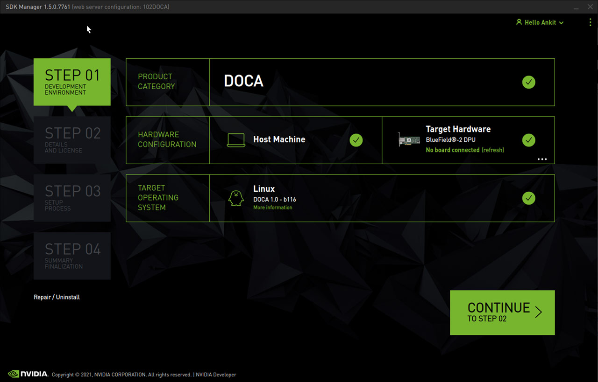

> 以下安装以Ubuntu20.04版本为例，官网未推荐1604版本
> 留出足够的空间，安装时尽量保证ubuntu系统有超过50g的剩余空间，极限情况留出30g，否则可能安装失败
### SDK Manager下载
> 官网下载链接https://developer.nvidia.com/nvidia-sdk-manager

1. 利用dkpg安装deb包。如果遇到以来问题，可以执行sudo apt --fix-broken install解决
2. 打开sdkmanager软件

> 第一行可能会出现其他选项，要选择DOCA
> 第三行选择1.1版本
3. 点击continue按照步骤安装
4. 安装过程中，terminal中可能出现error报错，不用处理，只要最后变成finish状态即可
5. 可能会出现docker缺少的问题，采用手动安装docker的方式进行解决。且如果doca因为docker安装失败，可以在step01中选择repair或直接安装或uninstall后再安装进行重试。

下一步，[跑样例](./跑样例.md)