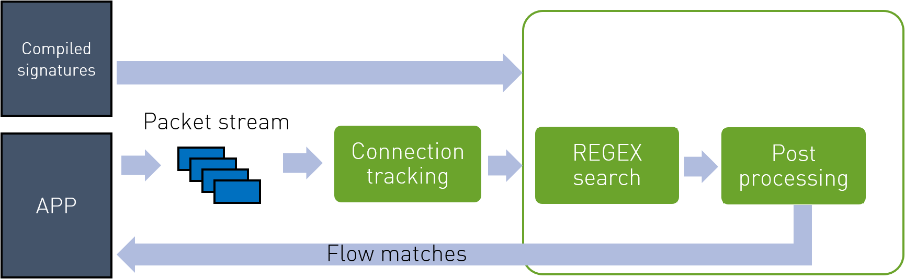
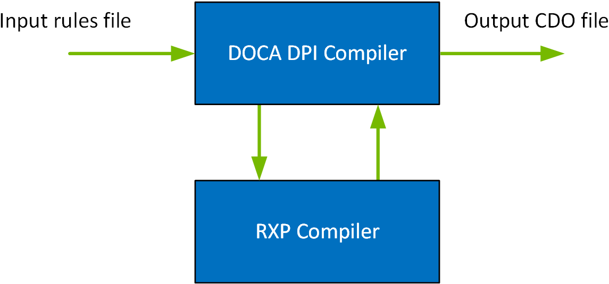

## DPI Architecture



## DPI Compiler


> 支持Suricata
> 处理的是TCP和UDP

```
alert 
udp 
any any -> any 53 
(
    msg:"ET DOS DNS BIND 9 Dynamic Update DoS attempt"; 
    byte_test:1,&,40,2; 
    byte_test:1,>,0,5; 
    byte_test:1,>,0,1; 
    content:"|00 00 06|"; 
    offset:8; 
    content:"|c0 0c 00 ff|"; 
    distance:2; 
    reference:cve,2009-0696; 
    reference:url,doc.emergingthreats.net/2009701; 
    classtype:attempted-dos; 
    sid:2009701; 
    rev:2; 
    metadata:created_at 2010_07_30, updated_at 2010_07_30;
)
```

## 执行compiler
### 前提
安装json-c library
> RHEL: yum install json-c
> Debian: apt install json-c

### 执行过程
> 格式： ./doca_dpi_compiler -i [in_rules] -o [out_rules.cdo] -f [format] -r [rxpc_path]
> 样例： ./doca_dpi_compiler -i ./suricata_rules.rules -o compiler_output.cdo -f suricata -r /usr/bun/rxpc

> RXP指的是正则表达式