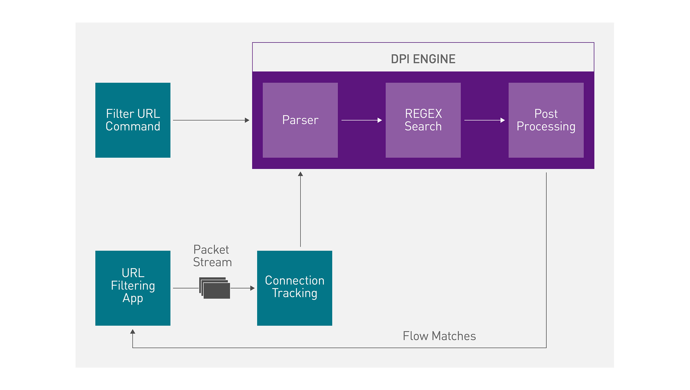

### url_filter
url_filter流程图

[代码执行流程](./url/filter)
### 运行样例
1. 按顺序执行以下代码
> cd /opt/mellanox/doca/examples/url_filter/src
> meson /tmp/build 
> ninja -C /tmp/build
2. 执行代码过程中可能会报错，libdpdk依赖缺失
Ubuntu执行```export PKG_CONFIG_PATH=$PKG_CONFIG_PATH:/opt/mellanox/dpdk/lib/x86_64-linux-gnu/pkgconfig```
> 官网这里应该给错了，官网给的不是x86_64-linux-gnu，而是aarch64，但是系统内并无此路径
3. dpdk相关设定
```
echo 2048 > /sys/kernel/mm/hugepages/hugepages-2048kB/nr_hugepages
sudo mkdir /mnt/huge
sudo mount -t hugetlbfs nodev /mnt/huge
systemctl start mlx-regex
```
4. 执行
```
/opt/mellanox/doca/examples/url_filter/bin/doca_url_filter -a 0000:03:00.0,class=regex -a auxiliary:mlx5_core.sf.4,sft_en=1 -a auxiliary:mlx5_core.sf.5,sft_en=1 -c3 –– -p
```

> 样例并未成功编译执行
> 原因在于用meson库编译时，没有找到libdpdk库
> 但是export路径之后，利用```pkg-config --modversion libdpdk```可以正常显示库的版本信息
> 目前推断是在meson从PKG_CONFIG_PATH路径上读取libdpdk库出现了问题
> github有人提出过类似的问题(不是libdpdk库)，但是没有找到解决方案
> 目前和另一个同学分为两拨，我继续再ubuntu下，继续研究这个问题，另一个同学再centos下安装doca进行测试
> 样例netflow由于不包含libdpdk库，所以可以编译成功


### 依赖补充
meson编译时需要补充依赖
1. libelf
```
apt install libelf-dev
```

2. jansson
```
git clone https://github.com/akheron/jansson
apt install autoconf
apt install libtool
cd jansson
autoreconf -i #反解析configure.ac文件，生成编译工具
./configure
make
make install
```
3. json-c
```
git clone https://github.com/json-c/json-c.git
mkdir json-c-build
cd json-c-build
cmake ../json-c
make
sudo make install
```

4. libnghttp2
```
sudo apt install libnghttp2-dev
```

5. liburiparser
```
apt install liburiparser-dev
```
